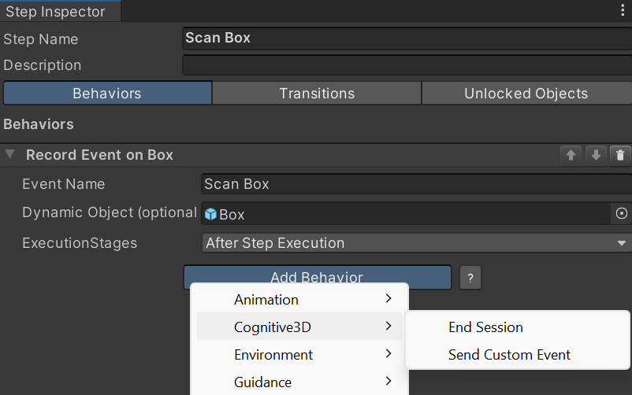

# Cognitive3D integration for VR Builder

- [Introduction](#introduction)
- [Installation](#installation)
	- [Requirements](#requirements)
	- [How to Install](#how-to-install)
- [Quick Start](#quick-start)
- [Process Behaviors](#process-behaviors)
	- [Send Custom Event Behavior](#send-custom-event-behavior)
	- [End Session Behavior](#end-session-behavior)
- [Contact](#contact)

## Introduction

VR Builder is a tool for quickly creating sequential interactive processes, like for example tutorials, by using an easy-to-use visual editor. This add-on allows the use of VR Builder together with the [Cognitive3D](https://cognitive3d.com/) analytics framework.

## Installation

### Requirements
- This add-on requires VR Builder version v3.3.2 or later to work.
- This add-on is based on Cognitive3D 1.3.9. Earlier versions might work, but they are untested.

### How to Install

1. First, ensure that both Cognitive3D and VR Builder are present in the project.
2. Import the Unity package for this add-on; it will be placed into `Assets/MindPort/VR Builder/Add-ons/Cognitive3DIntegration/`.

## Quick Start

If you are new to VR Builder, we strongly suggest getting familiar with the basics in the core [documentation](https://www.mindport.co/vr-builder/manual/introduction), also available in the asset's folder.

The Documentation for Cognitive3D can be found [here](https://docs.cognitive3d.com/)

## Process Behaviors

This integration includes the following process behaviors which will make use of the Cognitive3D Unity Plugin.

### Send Custom Event Behavior
This can be used for tracking a step before or after its execution is happening. It is possible to attach a Cognitive3D DynamicObject to the event to add more context to an event. For more infos, have a look at the Cognitive3D documentation about SendCustomEvent and DynamicObject.

Note: It is possible to extend this behavior to add additional data to the CustomEvent.

### End Session Behavior
This can be used to end a tracking session during a running training. For example, if multiple persons do the same training without restarting the Unity scene in which the training runs. For more info, have a look at the Cognitive3D documentation on EndSession.

## Contact

Join our official [Discord server](http://community.mindport.co) for quick support from the developer and fellow users. Suggest and vote on new ideas to influence the future of the VR Builder.

Make sure to review [VR Builder](https://assetstore.unity.com/packages/tools/visual-scripting/vr-builder-201913) if you like it. It will help us immensely.

If you have any issues, please contact [contact@mindport.co](mailto:contact@mindport.co). We'd love to get your feedback, both positive and constructive. By sharing your feedback you help us improve - thank you in advance!
Let's build something extraordinary!

You can also visit our website at [mindport.co](http://www.mindport.co).